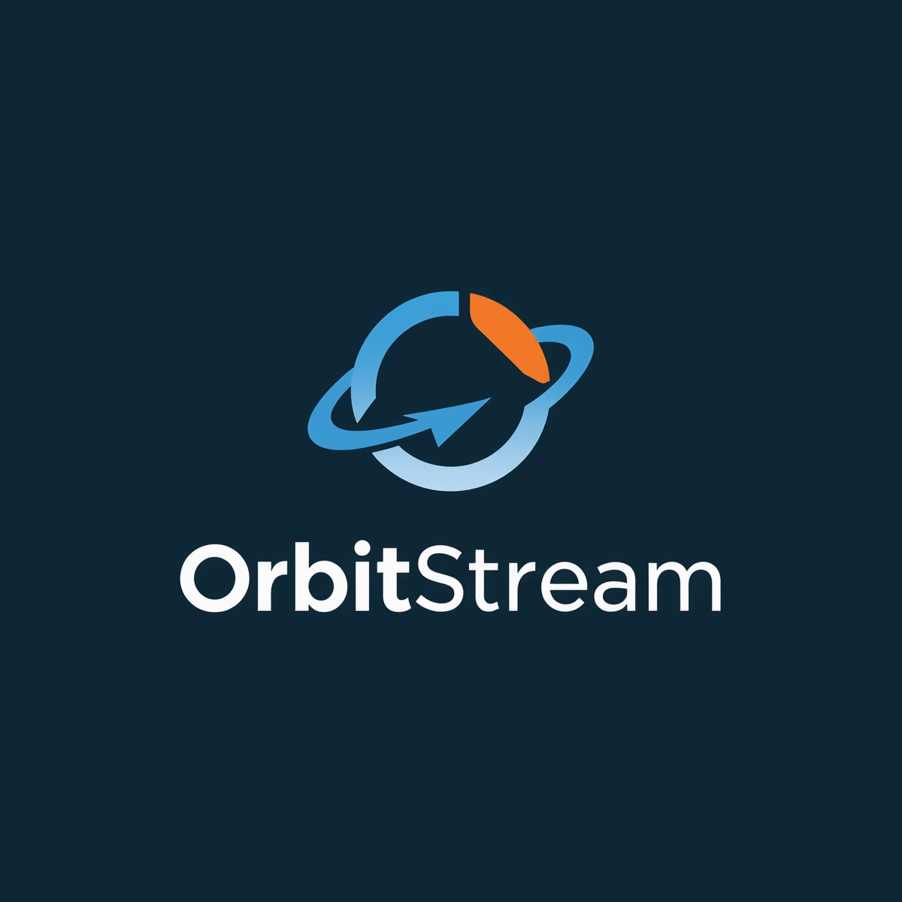

<p align="center">
  
</p>

<h1 align="center">OrbitStream</h1>

<p align="center">
  <strong>Stripe-like checkout for the Stellar network.</strong><br />
  Accept USDC, EURC, and XLM payments in minutes — with 5-second finality and near-zero fees.
</p>

<p align="center">
  <a href="https://github.com/OrbitStream/OrbitStream_backend/actions"></a>
  <a href="https://github.com/OrbitStream/OrbitStream_backend/blob/main/LICENSE"></a>
  <a href="https://github.com/OrbitStream"></a>
</p>

---

## Why OrbitStream?

Stellar has the best payment rails in crypto — sub-5-second settlement, $0.00001 transaction fees, $83M+ USDC supply, and MoneyGram cash-out at 350K+ locations worldwide. But there's no merchant-facing product layer.

**OrbitStream bridges that gap.**

A business that wants to accept USDC on Stellar today must build payment detection, confirmation logic, checkout UI, and settlement flows from scratch. OrbitStream gives them a Stripe-like experience: a hosted checkout page, embeddable widget, JS SDK, and webhook system — so any merchant can start accepting Stellar payments in under 10 minutes.

---

## Repositories

| Repository | Description |
|------------|-------------|
| [`OrbitStream_backend`](https://github.com/OrbitStream/OrbitStream_backend) | NestJS API — checkout sessions, payment detection, webhook dispatch, merchant auth |
| [`orbitstream_frontend`](https://github.com/OrbitStream/orbitstream_frontend) | Next.js app — hosted checkout page, merchant dashboard |
| [`orbitstream_contracts`](https://github.com/OrbitStream/orbitstream_contracts) | Soroban smart contracts — on-chain escrow for marketplace payments |
| [`OrbitStream-Checkout-sdk`](https://github.com/OrbitStream/OrbitStream-Checkout-sdk) | `@orbitstream/sdk` — TypeScript SDK for integrating OrbitStream |
| [`orbitstream_docs`](https://github.com/OrbitStream/orbitstream_docs) | Architecture specs, API reference, integration guides |

---

## How It Works

```
1. Merchant creates checkout session via API or SDK
2. Backend generates unique memo, returns checkout URL
3. Customer visits checkout page — scans QR or connects Freighter wallet
4. Customer signs payment (USDC / XLM / EURC)
5. Payment detector matches incoming payment by memo via Horizon streaming
6. Backend marks session paid, dispatches HMAC-signed webhook
7. Customer sees confirmation screen
```

---

## Quick Start

### SDK

```ts
import { OrbitStream } from '@orbitstream/sdk';

const checkout = new OrbitStream({ apiKey: 'sk_test_...' });

const session = await checkout.createSession({
  amount: 25.00,
  asset: 'USDC',
  successUrl: 'https://example.com/success',
});

// Redirect customer to session.url
```

### Frontend Widget

```html
<script src="https://cdn.orbitstream.dev/sdk.js"></script>
<orbitstream-checkout
  session-id="cs_live_..."
  theme="dark"
></orbitstream-checkout>
```

---

## Architecture

```
┌─────────────────────────────────────────────────────────────────┐
│                       OrbitStream                                │
├──────────────┬──────────────┬──────────────┬────────────────────┤
│  Frontend    │  Backend     │  Contracts   │  SDK               │
│              │              │              │                    │
│  Next.js     │  NestJS      │  Soroban     │  @orbitstream/sdk  │
│  Tailwind    │  Drizzle ORM │  Escrow      │  TypeScript        │
│  shadcn/ui   │  PostgreSQL  │  Contract    │                    │
│              │  Redis       │              │                    │
├──────────────┴──────────────┴──────────────┴────────────────────┤
│                       Stellar Network                            │
│  5s finality · $0.00001 fees · USDC · EURC · XLM               │
│  SEP-10 auth · SEP-24 fiat ramps · Built-in DEX · Anchors       │
└─────────────────────────────────────────────────────────────────┘
```

---

## Stellar-Native Features

| Feature | OrbitStream Uses It For |
|---------|------------------------|
| **SEP-10** | Wallet-based merchant authentication |
| **SEP-24** | Fiat on/off ramps via anchor iframe |
| **Muxed Accounts** | Sub-addressing for payment matching |
| **Claimable Balances** | Escrow without smart contracts |
| **Built-in DEX** | Multi-asset acceptance with auto-conversion |

---

## Getting Started

1. **Sign up** — Connect your Stellar wallet at [orbitstream.dev](https://orbitstream.dev)
2. **Get an API key** — Instant testnet key, no paperwork
3. **Integrate** — Use the SDK, hosted checkout links, or embeddable widget
4. **Go live** — Switch to mainnet when ready

---

## Contributing

We welcome contributions across all repositories. See each repo's `CONTRIBUTING.md` for guidelines.

- **Report bugs** — Open an issue in the relevant repository
- **Request features** — Start a discussion in the relevant repository
- **Submit PRs** — Fork, branch, and open a pull request

---

## License

All OrbitStream repositories are licensed under the [MIT License](https://opensource.org/licenses/MIT).

---

<p align="center">
  Built on <strong>Stellar</strong> — the network for fast, cheap, global payments.
</p>
